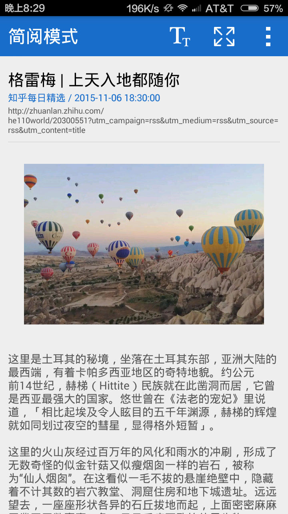

#中文版

## 项目说明 
一个开源的程序支持RSS和Atom订阅，支持订阅和分享内容给朋友们。

## 项目导航图

- ProjectStructureMap.mmap
	- 这个文件时项目的结构图

注：*.nmap的文件为MindManger生成的文件

## 预览

-----------------
#English Version

## Project Description 
An open-source application that parse RSS or Atom feed from Internet,you also can subscribe to a feed and share with you friends.

## Project Navigation

- ProjectStructureMap.mmap
	- this file was described the structure of this project.

Notice：*.nmap files was built by MindManger

## Screenshoot

add_page:

content_page:

detail_page:

discover_page:

favor_page:

feed_page:

label_page:

setting_page:
